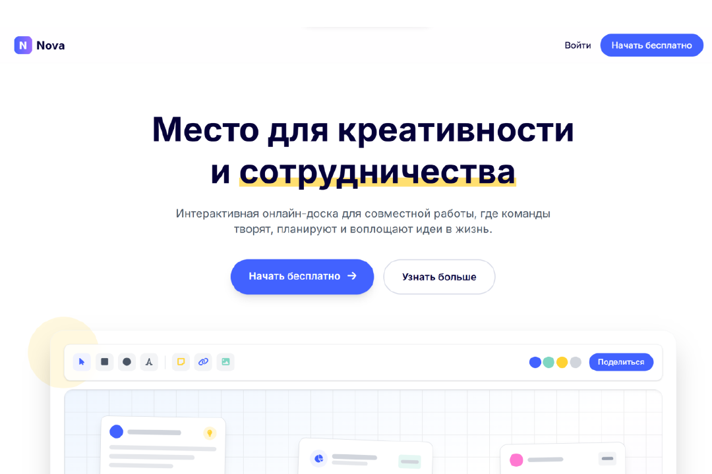
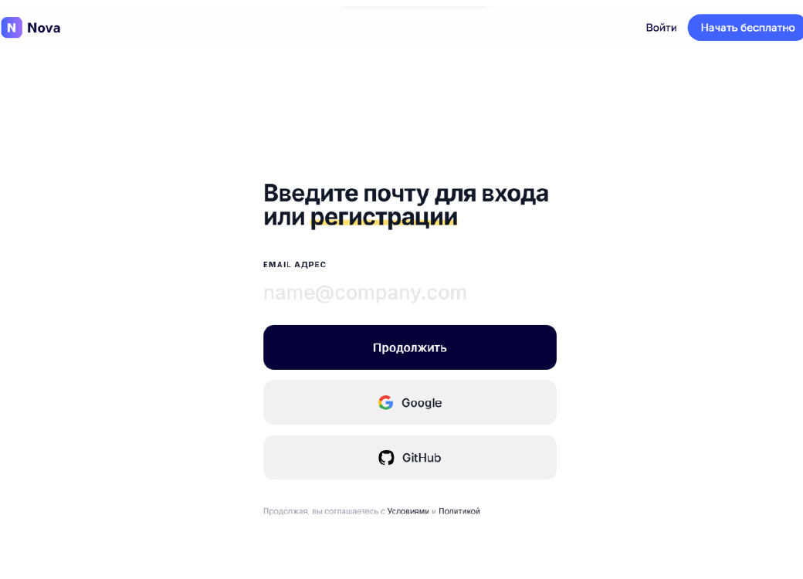
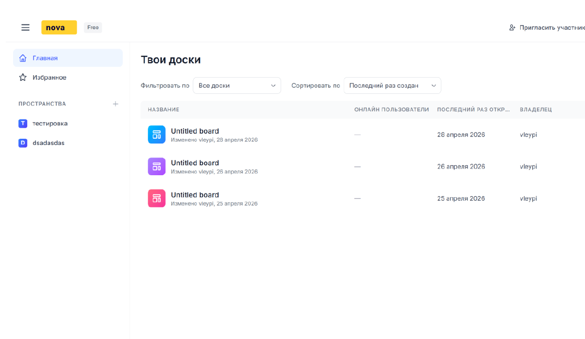
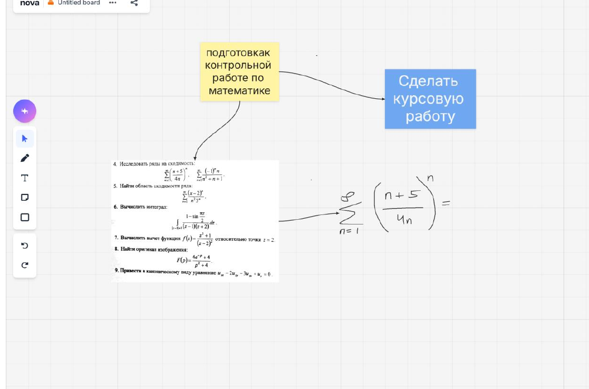
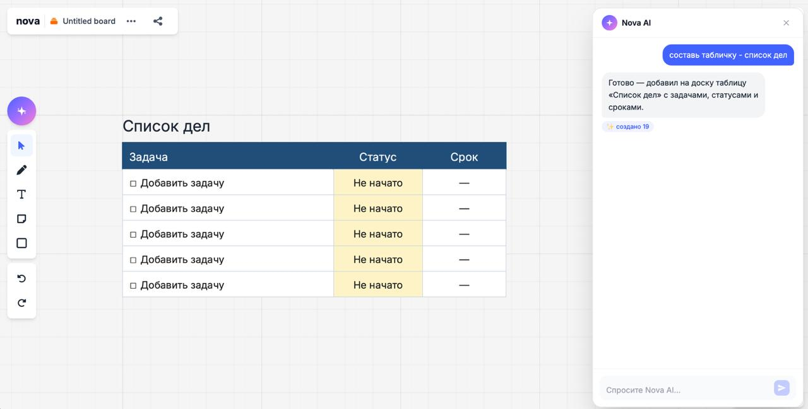

<h1>
  
</h1>

**Онлайн-доска для совместной работы с собственным canvas-движком и AI-агентом, который управляет содержимым холста напрямую.**


Nova - интерактивная онлайн-доска для совместной работы, где пользователи создают пространства и доски, редактируют их сами или через AI-агента и видят изменения в реальном времени.

*Курсовой проект 2 курса, РТУ МИРЭА.*

## Проблема

Командам нужно общее визуальное пространство: для планирования, обсуждения идей, работы с материалами. Nova - доска в стиле Miro, Unidrwa и FigmaJam с пространствами, холстом с полным набором графических примитивов и совместным редактированием в реальном времени.

В основе проекта - собственный canvas-движок, написанный с нуля без сторонних библиотек вроде React Flow. Он отвечает за рендеринг элементов, трансформации холста (zoom и pan), hit-testing и выделение, drag и resize, историю действий с undo и redo, а также синхронизацию состояния между клиентами через WebSocket.

Второй ключевой блок - AI-агент на холсте. Это не чат, который отвечает по содержимому доски, а LLM с доступом к функциям холста: по текстовому запросу агент сам создаёт, редактирует, перемещает, удаляет и компонует элементы, используя те же операции, что доступны пользователю через интерфейс.

Работа показывает разработку full-stack приложения с микросервисным backend, real-time обменом данными и контейнерным развёртыванием.

## Функционал

- Авторизация по email с одноразовым кодом, а также через Google и GitHub.
- Управление профилем и пользовательскими сессиями.
- Создание, редактирование и удаление пространств.
- Приглашение участников по ссылке, управление ролями и разрешениями.
- Создание, переименование, перемещение, удаление и добавление досок в избранное.
- Работа с приватными досками, дублированием и экспортом содержимого.
- Добавление текста, фигур, заметок, изображений, стрелок, фреймов и рукописных линий на холст.
- Перемещение, изменение размера, выделение, блокировка и удаление элементов.
- Масштабирование, перемещение холста, история действий и отмена изменений.
- Синхронизация элементов, курсоров и присутствия участников в реальном времени.
- AI-агент на холсте: создаёт, редактирует, перемещает, удаляет и компонует элементы по текстовому запросу, используя функции доски напрямую.
- Загрузка изображений в MinIO через предварительно подписанные URL.
- Административная панель для управления пользователями, пространствами, досками, журналом аудита, состоянием сервисов и real-time подключениями.

## Технологический стек

- **TypeScript**: общий язык разработки frontend и backend.
- **Next.js 16, React 19, Tailwind CSS**: клиентское приложение, компоненты и стили.
- **Собственный canvas-движок**: рендеринг элементов, трансформации холста, hit-testing, drag/resize, история изменений (undo/redo) и синхронизация состояния — реализованы с нуля, без сторонних canvas-библиотек.
- **TanStack Query, Axios**: запросы к API, кэширование и обновление серверных данных.
- **NestJS**: backend-сервисы, REST API, валидация и документация API.
- **gRPC**: обмен данными между API Gateway и внутренними сервисами.
- **Socket.IO**: синхронизация досок и событий в реальном времени.
- **Redis и Redis adapter для Socket.IO**: передача WebSocket-событий между экземплярами сервиса.
- **LLM API с function calling**: AI-агент получает доступ к функциям доски (создание, редактирование, удаление, компоновка элементов) и выполняет их по запросу пользователя.
- **PostgreSQL и TypeORM**: хранение пользователей, пространств, досок, элементов и журнала аудита.
- **MinIO и S3 SDK**: объектное хранилище изображений.
- **JWT и httpOnly cookies**: аутентификация и хранение токенов сессии.
- **Docker Compose, Nginx**: запуск сервисов в контейнерах и балансировка запросов к API Gateway.
- **MailHog, Nodemailer**: локальная отправка и просмотр писем с кодами авторизации.
- **Jest**: модульное тестирование frontend и backend.

## Архитектура

Frontend на Next.js обращается к API Gateway по HTTP и к сервису совместной работы по WebSocket. Gateway передаёт бизнес-запросы во внутренние сервисы по gRPC. Данные хранятся в PostgreSQL, Redis используется для распространения событий Socket.IO, а изображения сохраняются в MinIO.

```text
Next.js frontend
       |
       +-- HTTP --> Nginx --> API Gateway
       |                      |
       |                      +-- gRPC --> Users Service --> PostgreSQL
       |                      +-- gRPC --> Auth Service ---> Redis, MailHog
       |                      +-- gRPC --> Boards Service -> PostgreSQL, MinIO
       |
       +-- WebSocket --> Collaboration Service --> Redis, Boards Service
```

AI-агент работает внутри Collaboration Service и вызывает те же функции изменения доски, что использует пользовательский интерфейс, — поэтому его правки распространяются на всех участников в реальном времени, как обычные действия пользователя.

## Файловая архитектура

```text
.
├── frontend/                       # Клиентское приложение на Next.js
│   ├── src/
│   │   ├── app/                    # Страницы и layouts App Router
│   │   ├── features/               # Функциональные модули интерфейса
│   │   │   ├── auth/               # Авторизация
│   │   │   ├── board/              # Собственный canvas-движок, инструменты и WebSocket-синхронизация
│   │   │   ├── spaces/             # Рабочие пространства и участники
│   │   │   ├── admin/              # Административная панель
│   │   │   └── landing/            # Главная страница
│   │   └── shared/                 # Общие API-клиенты, конфигурация и утилиты
│   └── public/                     # Статические файлы
├── backend/                        # Микросервисный backend на NestJS
│   ├── apps/
│   │   ├── api-gateway/            # REST API, guards и Swagger
│   │   ├── auth-service/           # Авторизация, OAuth и email-коды
│   │   ├── users-service/          # Пользователи и журнал аудита
│   │   ├── boards-service/         # Пространства, доски и файлы
│   │   └── collaboration-service/  # WebSocket, Redis adapter и AI-агент
│   ├── libs/common/                # Общие типы, константы и конфигурация
│   ├── proto/                      # gRPC Protobuf-схемы
│   └── scripts/                    # Резервное копирование и восстановление данных
├── docker/                         # Конфигурация Nginx и PostgreSQL
├── docs/screenshots/               # Скриншоты для README
└── docker-compose.yml              # Состав контейнеров приложения
```

## Установка и запуск

Для запуска нужны Docker и Docker Compose.

```bash
docker compose up --build -d
```

После запуска откройте приложение по адресу [http://localhost:3000](http://localhost:3000).

Дополнительные сервисы доступны по адресам:

- API Gateway: [http://localhost:4000](http://localhost:4000), API приложения, с которым работает клиентская часть.
- MailHog: [http://localhost:8025](http://localhost:8025), локальная почта для разработки. Письма с одноразовыми кодами авторизации появляются здесь после отправки формы входа.
- MinIO Console: [http://localhost:9001](http://localhost:9001), интерфейс хранилища изображений, загруженных на доски.

Чтобы остановить контейнеры, выполните:

```bash
docker compose down
```

## Пример использования

1. Откройте страницу авторизации и войдите по email-коду или через OAuth-провайдера.
2. Создайте пространство и пригласите участников по ссылке.
3. Добавьте доску в пространство.
4. Разместите на холсте текст, фигуры, заметки, изображения или связи между элементами.
5. Откройте ту же доску под другим аккаунтом, чтобы увидеть синхронизацию элементов и курсоров.
6. Опишите AI-агенту словами, что сделать на холсте — например, «сгруппируй стикеры по цвету» — и он выполнит это самостоятельно.

### Главная страница



### Авторизация



### Рабочие пространства



### Интерактивная доска



### AI-агент на доске



## Итоги

В проекте реализовано full-stack приложение для совместной работы с микросервисной архитектурой: собственный canvas-движок, AI-агент с доступом к функциям доски, авторизация и разграничение доступа, хранение файлов и синхронизация в реальном времени.

Работа демонстрирует навыки проектирования REST и gRPC API, разработки собственного canvas-рендеринга и взаимодействия с холстом, интеграции LLM с function calling, а также работы с React, PostgreSQL, Redis, WebSocket, Docker и тестами.

## Автор

**Парфенов Владимир Олегович**  
РТУ МИРЭА, 2026

- Email: [vleypi@gmail.com](mailto:vleypi@gmail.com)
- GitHub: [vleypi](https://github.com/vleypi)

Код распространяется по лицензии [MIT](LICENSE).
